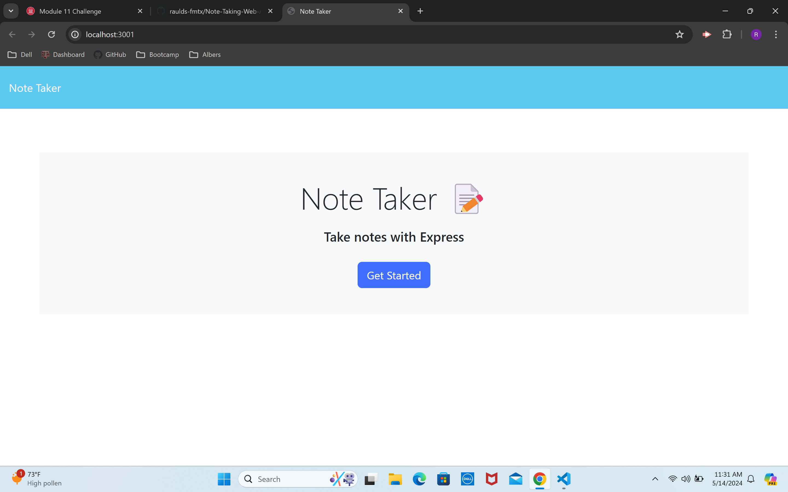
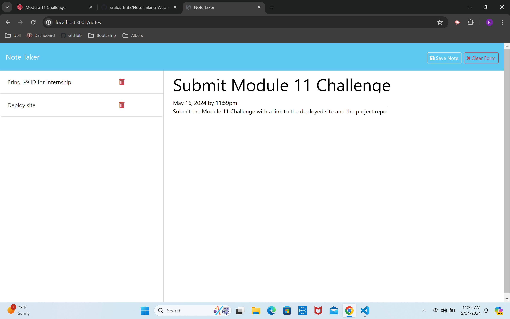

# Note-Taking-Web-App
    
 
    
A Note Taking Web Application that enables a user to save and delete custom notes using data persistence tools powered by express.js.
    
## Table of Contents
    
* [Installation](#Installation)
    
* [Usage](#Usage)
    
* [Tests](#Tests)
    
* [License](#License)
    
* [Author](#Author)
    
## Installation
    
No installation required.
    
## Usage

To access this webpage go to the following link:
[Note Taking Web App](https://note-taking-web-app-8p8a.onrender.com/)
    
To begin, when on the landing page, click 'Get Started,' and you will be routed to the note taking page. From there, you may type a title and contents for your note in the available text fields. To save your note, click the 'Save Note' button in the right side of the navbar, at which point the note title will appear in the left sidebar of the page. To clear the form and start over, click the 'Clear Form' button in the right side of the navbar. To view a saved note, click the note's title in the sidebar. To delete a saved note, click the trash can icon next to the note's title.
    

## License
    
This project is license under the MIT License - see the [License](https://choosealicense.com/licenses/mit/)
    
## Author
    
Raul Santos
    
Github: [raulds-fmtx](https://github.com/raulds-fmtx)

Repo: [Note-Taking-Web-App](https://github.com/raulds-fmtx/Note-Taking-Web-App)